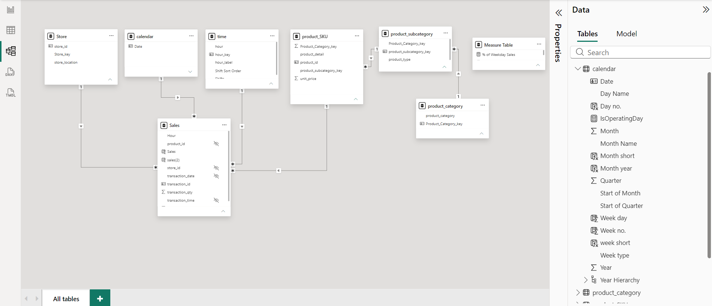
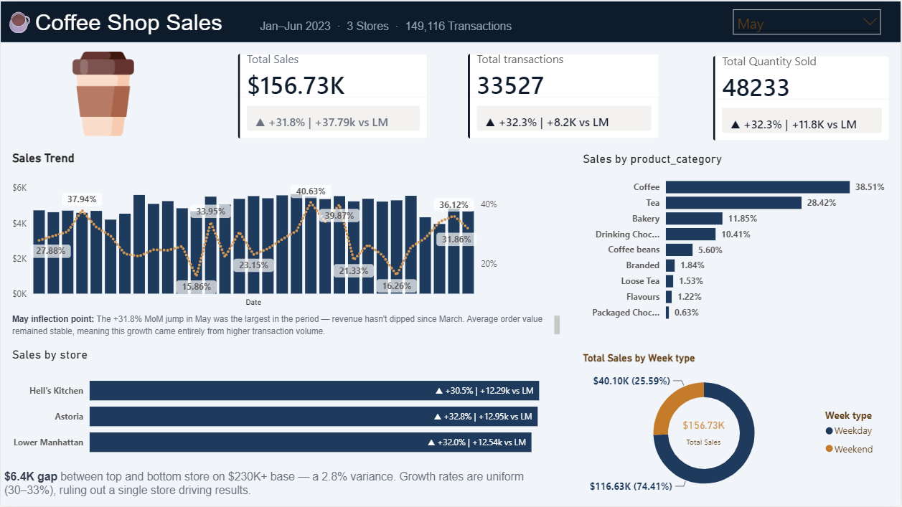
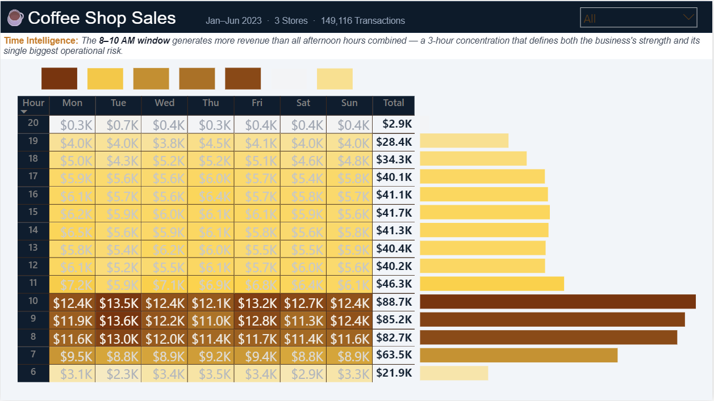
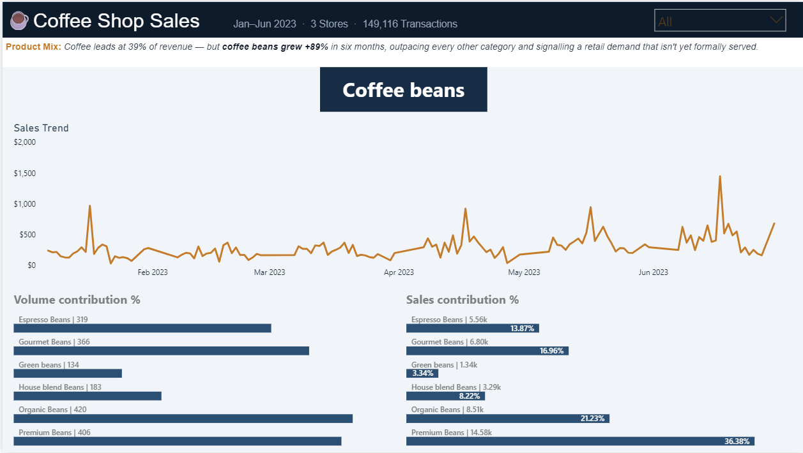

# ☕ Coffee Shop Sales & Operations Analysis

## Project Overview

This project analyzes six months of transactional sales data from a multi-store coffee chain to identify revenue drivers, customer purchasing patterns, operational risks, and growth opportunities.

Using Power BI, Power Query, and dimensional data modeling, the analysis transforms raw transactional data into business insights that support operational planning and decision-making.

---

## Business Objective

The objective of this analysis was to answer the following business questions:

- What is driving revenue growth?
- Which products contribute the most value?
- When does the business generate most of its revenue?
- Are stores performing consistently?
- What operational risks and growth opportunities exist?

---

## Dataset Summary

| Metric | Value |
|----------|----------|
| Analysis Period | Jan 2023 – Jun 2023 |
| Stores | 3 |
| Transactions | 149,116 |
| Total Revenue | $698.8K |

---

## Tools & Technologies

- Power BI
- Power Query
- DAX
- Data Modeling

---

## Skills Demonstrated

- Data Modeling
- Dimensional Modeling
- Business Performance Analysis
- Time Intelligence Analysis
- Product Mix Analysis
- Revenue Trend Analysis
- Dashboard Design
- Data Storytelling

---

## Data Model

The source dataset was provided as a flat transactional table.

To improve analytical flexibility and reporting performance, the data was transformed into a dimensional model consisting of:

### Fact Table

- Sales

### Dimension Tables

- Calendar
- Time
- Store
- Product SKU
- Product Subcategory
- Product Category

This structure enables efficient aggregation, time intelligence calculations, product hierarchy analysis, and scalable reporting.

### Data Model



---

## Dashboard Pages

### 1. Executive Overview

Provides a high-level view of:

- Revenue performance
- Sales growth
- Store comparison
- Product category contribution
- Weekday vs Weekend performance



---

### 2. Time Intelligence Analysis

Analyzes revenue patterns across different hours and days to identify peak business periods and operational dependencies.

**Key Question:**  
When does the business generate the majority of its revenue?



---

### 3. Product Mix Analysis

Evaluates product category performance and identifies growth opportunities across different product groups.

**Key Question:**  
Which products drive revenue today, and which products may drive future growth?



---

## Key Business Insights

### Revenue Growth

Revenue increased from approximately **$81.7K in January** to **$166.5K in June**, representing more than **100% growth within six months**.

### Revenue Concentration Risk

The **8–10 AM period generates more revenue than all afternoon hours combined**, creating a significant operational dependency on a three-hour window.

**Business Implication:**  
Staffing, inventory availability, and equipment uptime during the morning rush have a disproportionate impact on total revenue.

### Emerging Retail Opportunity

Coffee beans were the fastest-growing product category during the analysis period, nearly doubling in revenue over six months.

**Business Implication:**  
The business may benefit from expanding retail-focused offerings such as take-home products, subscriptions, or bundled promotions.

### Consistent Store Performance

All three stores exhibited similar growth patterns and sales performance, indicating that business growth is broadly distributed rather than dependent on a single location.

### Weekday Revenue Dependency

Approximately **72% of total revenue is generated during weekdays**, highlighting an opportunity to improve weekend monetization through targeted promotions or product offerings.

---

## Recommendations

Based on the analysis, the following actions could be considered:

- Prioritize staffing and inventory planning during the 8–10 AM peak revenue window
- Explore coffee bean retail expansion and subscription opportunities
- Develop weekend-specific promotions to increase weekend revenue contribution
- Replicate successful sales practices across all locations
- Continue monitoring growth drivers to support future expansion decisions

---

## Repository Structure

```text
coffee-shop-sales-analysis

├── README.md
├── assets
├── documentation
```

---

## Author

**Rohit Kumar**


